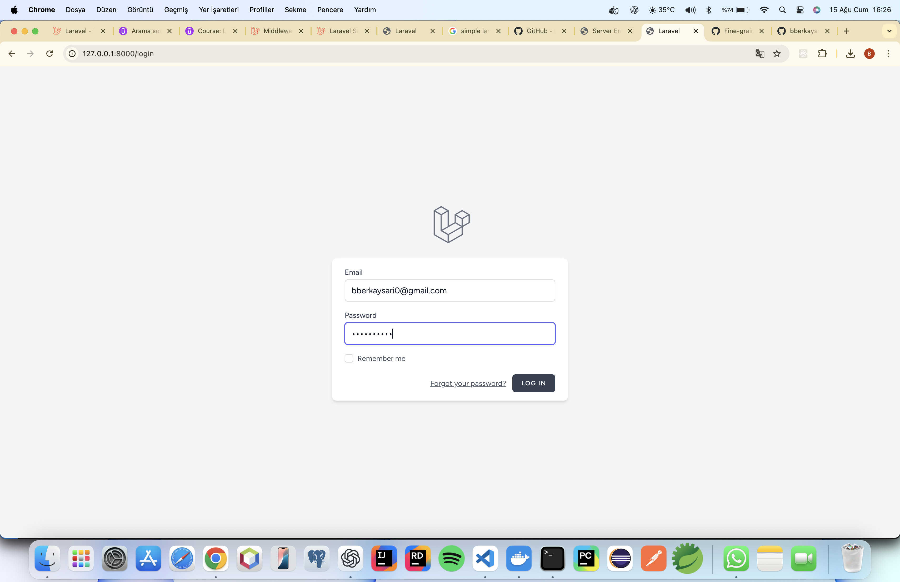
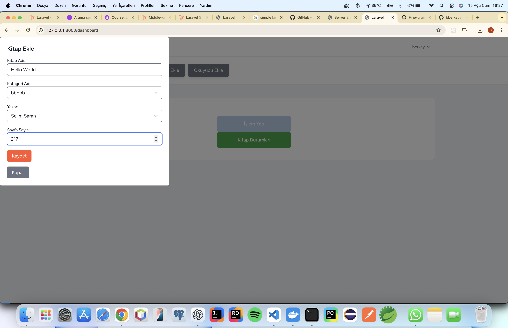
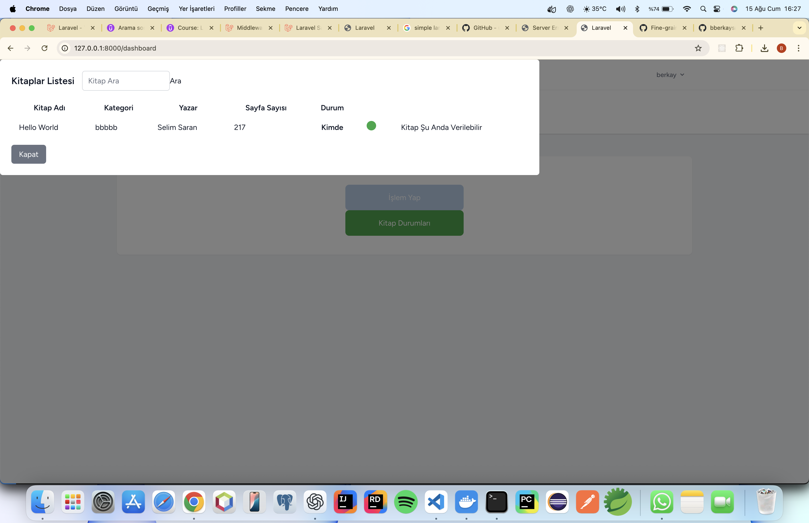

# 📚 Library Automation System

Laravel tabanlı, kütüphane yönetimi için geliştirilmiş bir web uygulaması.  
Kullanıcılar kitap, yazar, kategori ve okuyucu ekleyebilir; kitapların durumlarını takip edebilir.  

## 🚀 Özellikler
- **Kitap Yönetimi**
  - Kitap ekleme, listeleme, sayfa sayısı ve duruma göre takip
- **Kategori Yönetimi**
  - Kategoriler ekleme ve kitaplarla ilişkilendirme
- **Yazar Yönetimi**
  - Yazar ekleme ve kitaplara atama
- **Okuyucu Yönetimi**
  - Okuyucu ekleme ve kitap ödünç verme/geri alma işlemleri
- **Kitap Durumu Takibi**
  - Kitap şu anda kütüphanede mi yoksa ödünçte mi bilgisi

## 🛠️ Teknolojiler
- **Backend**: [Laravel 11](https://laravel.com/)
- **Frontend**: Blade, Bootstrap, Vite
- **Veritabanı**: MySQL / MariaDB
- **Oturum & Kimlik Doğrulama**: Laravel Breeze / Auth
- **Diğer**: Eloquent ORM, Laravel Migration & Seeder

## 📸 Ekran Görüntüleri

| Giriş Sayfası | Dashboard |
|---------------|-----------|
|  |  |

| Kitap Ekleme | Kitap Listesi |
|--------------|--------------|
|  |  |

| Kitap Listeleme | Kitap Listesi |
|--------------|--------------|
|  |  |

